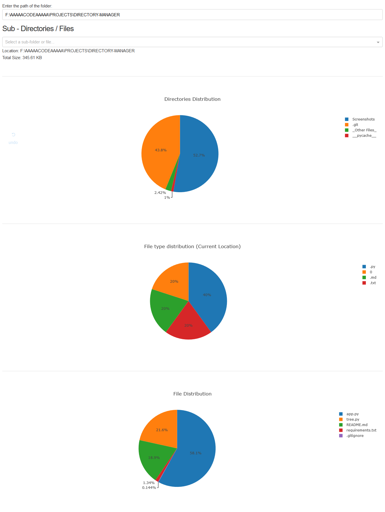

# Directory Manager 

This is my solution to the [Git-Heat Week-2 Problem](https://github.com/ietbitmesra/Git-Heat/tree/master/Week-2) organised by IET BIT Mesra.

* Input: Path of a directory
* Output: 
	* Pie Charts of file, folder, file-type distribution
	* Size of directory
	* Size of sub-directory/files

* This is a dash app written in Python3
* Modules/packages used: os, plotly
* To run the app:
	* Go to the command line and enter: 
	```sh 
	python app.py 
	```
	* Open your browser and visit http://127.0.0.1:8050/ 

## About Dash

Dash is a productive Python framework for building web applications.

Written on top of Flask, Plotly.js, and React.js, Dash is ideal for building data visualization apps with highly custom user interfaces in pure Python. It's particularly suited for anyone who works with data in Python.

If you'd like to know more about Dash: [Dash Getting Started](https://dash.plot.ly)

## Getting Started

* [Installing Python3](https://www.commonlounge.com/discussion/59b4cc482d6c4ebab9c3653cce230955)

* Installing Dash and plotly
In your terminal, install several dash libraries. These libraries are under active development, so install and upgrade frequently. Python 2 and 3 are supported.
```sh
pip install -r requirements.txt

```

>PS: This is my first dash app, suggestions and advice will be very helpful.


## Screenshot



